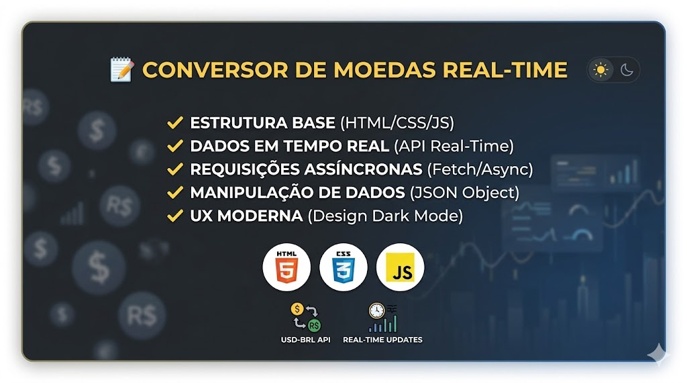

# 💵 Conversor de Moedas Real-Time

Aplicação web que realiza a conversão de Dólar (USD) para Real (BRL) utilizando dados em tempo real fornecidos por API externa.

## 🚀 Tecnologias e Recursos
- **JavaScript (ES6+)**: Uso de `async/await` e `fetch` para requisições assíncronas.
- **API Real-Time**: Consumo da AwesomeAPI para cotações atualizadas.
- **CSS Moderno**: Interface dark mode com foco em experiência do usuário (UX).
- **Design Responsivo**: Adaptável para diferentes tamanhos de tela.

## 🧠 O que eu aprendi neste projeto
- Como conectar uma aplicação com dados externos do mundo real.
- Manipulação de objetos JSON recebidos via API.
- Tratamento de erros em requisições de rede.
